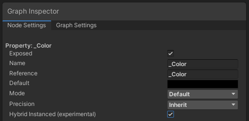

# DOTS Hybrid Renderer


Hybrid Renderer provides systems and components for rendering ECS entities.

Hybrid Renderer is not a render pipeline: it is a system that collects the data needed to render ECS entities, and sends this data to Unity's existing rendering architecture.

## Hybrid Renderer V1 and V2

This package contains two versions of Hybrid Renderer:

* [Hybrid Renderer V1](#v1) is the hybrid rendering technology introduced in the [Megacity](https://unity.com/megacity) project and released in Unity 2019.1. It is no longer in active development.
* [Hybrid Renderer V2](#v2) is a new experimental hybrid rendering technology introduced in Unity 2020.1. It provides better performance and an improved feature set. It is in active development.

## Compatibility and feature support

### Hybrid Renderer V1 render pipeline compatibility

|Render pipeline|Compatibility|
|:--|:--|
|Built-in Render Pipeline|Unity 2019.1 and above|
|High Definition Render Pipeline (HDRP)|Unity 2019.1 and above|
|Universal Render Pipeline (URP)|URP version 8.0.0 in Unity 2020.1 and above|

### Hybrid Renderer V2 render pipeline compatibility

|Render pipeline|Compatibility|
|:--|:--|
|Built-in Render Pipeline|Not supported|
|High Definition Render Pipeline (HDRP)|HDRP version 9.0.0 and above, with Unity 2020.1 and above|
|Universal Render Pipeline (URP)|URP version 9.0.0 and above, with Unity 2020.1 and above|

### Feature support

Hybrid Renderer V1 is no longer in active development, and the supported feature set for all render pipelines is limited. Hybrid Renderer V2 is early in development and some features are not yet supported, but we plan to support the full feature set.

**Important:** Hybrid Renderer V2 is considered experimental in Unity 2020.1. It is not yet production ready and should only be used for evaluation and prototyping purposes. We have tested it on Windows DX11, DX12, Vulkan and Mac Metal backends in both Editor and Standalone builds. Mobile device and console platform support is planned for 2020.2 release. In order to get the latest Hybrid Renderer V2 fixes and features, upgrading to the latest Unity version will be required.

#### URP features

Feature | V1 | V2
------- | -- | --
Material property overrides | Yes | Yes
Built-in property overrides | No | Yes
ShaderGraph | Yes | Yes
Lit shader | No | Yes
Unlit shader | No | Yes
RenderLayer | No | Yes
TransformParams | No | Yes
DisableRendering | No | Yes
Sun light | Yes | Yes
Point + spot lights | No | Planned for 2021
Ambient probe | No | Yes
Light probes | No | Yes
Reflection probes | No | Planned for 2021
Lightmaps | No | Yes
Shader keywords | No | Planned for 2021
LOD crossfade | No | Planned for 2021
Viewport shader override | No | Planned for 2021
Transparencies (sorted) | No | Yes
Occlusion culling (dynamic) | No | Experimental
Skinning / mesh deform | No | Experimental

#### HDRP features

Feature | V1 | V2
------- | -- | --
Material property overrides | Yes | Yes
Built-in property overrides | No | Yes
ShaderGraph | Yes | Yes
Lit shader | No | Yes
Unlit shader | No | Yes
Decal shader | No | Yes
LayeredLit shader | No | Yes
RenderLayer | No | Yes
TransformParams | No | Yes
DisableRendering | No | Yes
Motion blur | No | Yes
Temporal AA | No | Yes
Sun light | Yes | Yes
Point + spot lights | Yes | Yes
Ambient probe | Yes | Yes
Light probes | Yes | Yes
Reflection probes | Yes | Yes
Lightmaps | No | Yes
Shader keywords | No | Planned for 2021
LOD crossfade | No | Planned for 2021
Viewport shader override | No | Planned for 2021
Transparencies (sorted) | No | Yes
Occlusion culling (dynamic) | No | Experimental
Skinning / mesh deform | No | Experimental

## Hybrid Renderer overview

Hybrid Renderer acts as a bridge between DOTS and Unity's existing rendering architecture. This allows you to use ECS entities instead of GameObjects for significantly improved runtime memory layout and performance in large scenes, while maintaining the compatibility and ease of use of Unity's existing workflows.

### The GameObject conversion system

Hybrid Renderer package includes systems that convert GameObjects into equivalent DOTS entities. You can use these systems to convert the GameObjects in the Unity Editor, or at runtime. Conversion in Unity Editor results in significantly better scene loading performance.

To convert entites in the Unity Editor, put them in a SubScene. The Unity Editor performs the conversion, and saves the results to disk. To convert your GameObjects to entities at runtime, add a ConvertToEntity component to them.

Unity performs the following steps during conversion:

* The conversion system converts [MeshRenderer](https://docs.unity3d.com/Manual/class-MeshRenderer.html) and [MeshFilter](https://docs.unity3d.com/Manual/class-MeshFilter.html) components into a DOTS RenderMesh component on the entity. Depending on the render pipeline your Project uses, the conversion system might also add other rendering-related components.
* The conversion system converts [LODGroup](https://docs.unity3d.com/Manual/class-LODGroup.html) components in GameObject hierarchies to DOTS MeshLODGroupComponents. Each entity referred by the LODGroup component has a DOTS MeshLODComponent.
* The conversion system converts the Transform of each GameObject into a DOTS LocalToWorld component on the entity. Depending on the Transform's properties, the conversion system might also add DOTS Translation, Rotation, and NonUniformScale components.

### Runtime functionality

At runtime, the Hybrid Renderer processes all entities that have LocalToWorld, RenderMesh and RenderBounds DOTS components. Many HDRP and URP features require their own material property components. These components are added during the MeshRenderer conversion. Processed entities are added to batches. Unity renders the batches using the [SRP Batcher](https://blogs.unity3d.com/2019/02/28/srp-batcher-speed-up-your-rendering/).

Note that if you add entities to your Scene at runtime, it is better to instantiate Prefabs than to create new entities from scratch. Prefabs are already converted to an optimal data layout during DOTS conversion, which results in improved performance. Converted prefabs also automatically contain all the necessary material property components for enabling all supported HDRP and URP features. As we are frequently adding new features to the hybrid renderer, we recommend using the conversion pipeline and prefabs instead of manually building entities from scratch, to avoid compatibility issues when updating to new hybrid renderer package versions.

<a name="v1"></a>

## Using Hybrid Renderer V1

### Enabling Hybrid Renderer V1

When the Hybrid Renderer package is installed in your Project, Hybrid Renderer V1 is enabled by default.

### Setting up shaders for Hybrid Renderer V1

Hybrid Renderer V1 only supports ShaderGraph based shaders. Built-in shaders such as HDRP/Lit are not supported.

* Enable **Enable GPU Instancing** on every material used with the Hybrid Renderer:


* Unity 2019.1 only: Enable **DOTS Instancing** checkbox in ShaderGraph HDRP/Lit master node (cog menu):


* Unity 2019.2 only: Enable **GPU Instanced** checkbox in any ShaderGraph custom property:


* Unity 2019.3+ only: Enable **Hybrid Instanced (experimental)** for any Shader Graph custom property. This property is in the **Node Settings** tab of the **Graph Inspector**:


Unless every shader and material you use with Hybrid Renderer V1 is setup correctly, you might encounter visual issues. Unfortunately, there's no validation or error messages in Hybrid Renderer V1. The most common visual issues caused by incorrect Shader and Material setup are:

* All entities rendering at position (0,0,0) in standalone builds
* Flickering or incorrect colors, especially on DX12, Vulkan and Metal backends
* Flickering/stretching polygons, especially on DX12, Vulkan and Metal backends 

**Important:** If you are using Hybrid Renderer V1 with URP and an unsupported Unity version, you might see similar graphics issues. 

<a name="v2"></a>
## Using Hybrid Renderer V2

### Enabling Hybrid Renderer V2

To enable Hybrid Renderer V2, add the **ENABLE_HYBRID_RENDERER_V2** define to your Project's Scripting Define symbols:


When Hybrid Renderer V2 is active, Unity displays the following message in the Console window:

```
Hybrid Renderer V2 active, MaterialProperty component type count X / Y
```

## Hybrid Renderer features

### Built-in material property overrides (V2 only)

Hybrid Renderer V2 supports per-entity override of various HDRP and URP material properties. The package contains a built-in library of IComponentData components that you can add to your entities to override their material properties. You can also write C#/Burst code to setup and animate material override values at runtime.

**Supported HDRP Material Property overrides:**
* AlphaCutoff
* AORemapMax
* AORemapMin
* BaseColor
* DetailAlbedoScale
* DetailNormalScale
* DetailSmoothnessScale
* DiffusionProfileHash
* EmissiveColor
* Metallic
* Smoothness
* SmoothnessRemapMax
* SmoothnessRemapMin
* SpecularColor
* Thickness
* ThicknessRemap
* UnlitColor (HDRP/Unlit)

**Supported URP Material Property overrides:**
* BaseColor
* BumpScale
* Cutoff
* EmissionColor
* Metallic
* OcclusionStrength
* Smoothness
* SpecColor

If you want to override a built-in HDRP or URP property not listed here, you can do that with custom ShaderGraph material property overrides.

### Custom ShaderGraph material property overrides

You can create your own custom ShaderGraph properties, and expose them to DOTS as IComponentData. This allows you to write C#/Burst code to setup and animate your own shader inputs.

Select your Shader Graph custom property and view it in the **Graph Inspector**. Open the **Node Settings** tab and enable **Hybrid Instanced (experimental)** :


Then write a DOTS IComponentData struct:

```C#
[MaterialProperty("_Color", MaterialPropertyFormat.Float4)]
public struct MyOwnColor : IComponentData
{
    public float4 Value;
}
```

Ensure that the *Reference* name in ShaderGraph and the string name in MaterialProperty attribute match exactly. The type declared in the MaterialPropertyFormat should also be compatible with both the ShaderGraph and the struct data layout. If the binary size doesn't match, you will see an error message in the console window.

Now you can write Burst C# system to animate your material property:

```C#
class AnimateMyOwnColorSystem : SystemBase
{
    protected override void OnUpdate()
    {
        Entities.ForEach((ref MyOwnColor color, in MyAnimationTime t) =>
            {
                color.Value = new float4(
                    math.cos(t.Value + 1.0f), 
                    math.cos(t.Value + 2.0f), 
                    math.cos(t.Value + 3.0f), 
                    1.0f);
            })
            .Schedule();
    }
}
```

**Important:** You need to create a matching IComponentData struct (described above) for every custom ShaderGraph property that has **Hybrid Instanced (experimental)** enabled. If you fail to do so, Hybrid Renderer will not fill these properties: Hybrid Renderer V1 leaves the data uninitialized (flickering), and Hybrid Renderer V2 zero fills the data.

### Hybrid entities

Hybrid entities is a new DOTS feature. This feature allows you to attach MonoBehaviour components to DOTS entities, without converting them to IComponentData. A conversion system calls **AddHybridComponent** to attach a managed component to DOTS entity.

**The following graphics related hybrid components are supported by Hybrid Renderer:**
* Light + HDAdditionalLightData (HDRP)
* Light + UniversalAdditionalLightData (URP)
* ReflectionProbe + HDAdditionalReflectionData (HDRP)
* TextMesh
* SpriteRenderer
* ParticleSystem
* VisualEffect
* DecalProjector (HDRP)
* DensityVolume (HDRP)
* PlanarReflectionProbe (HDRP)
* Volume
* Volume + Sphere/Box/Capsule/MeshCollider pair (local volumes) 

Note that the conversion of Camera (+HDAdditionalCameraData, UniversalAdditionalCameraData) components is disabled by default, because the scene main camera can't be a hybrid entity. To enable this conversion, add **HYBRID_ENTITIES_CAMERA_CONVERSION** define to your project settings.

Unity updates the transform of a hybrid entity whenever it updates the DOTS LocalToWorld component. Parenting a hybrid entity to a standard DOTS entity is supported. Hybrid entities can be included in DOTS subscenes. The managed component is serialized in the DOTS subscene.

You can write DOTS ECS queries including both IComponentData and managed hybrid components. However, these queries cannot be Burst compiled and must run in the main thread, as managed components are not thread safe. Use WithoutBurst(), and call .Run() instead of .Schedule().

An example of setting HDRP Light component intensity:

```C#
class AnimateHDRPIntensitySystem : SystemBase
{
    protected override void OnUpdate()
    {
        Entities.WithoutBurst().ForEach((HDLightAdditionalData hdLight) =>
            {
                hdLight.intensity = 1.5f;
            })
            .Run();
    }
}
```

### The BatchRendererGroup API

[BatchRendererGroup](https://docs.unity3d.com/ScriptReference/Rendering.BatchRendererGroup.html) is the Unity Engine API that the Hybrid Renderer uses. If you are using the Hybrid Renderer, you don't need to interact with this API directly; however, if you are an advanced rendering engineer and you want to build your own renderer on top of this API, this section will give you some advice. 

**Important:** This API is experimental and changes frequently. We are adding support for all the remaining URP and HDRP features, and making the data model more efficient to provide AAA class performance. We do not guarantee that the current API will remain stable, and we have a long term plan to rewrite it completely to make it more flexible, efficient, and straightforward to use.

The BatchRendererGroup class actually presents two different versions of the API: one for Hybrid Renderer V1, and one for Hybrid Renderer V2. You cannot mix and match V1 and V2 API calls inside a single BatchRendererGroup instance.

**Common APIs:**
* [AddBatch](https://docs.unity3d.com/2020.1/Documentation/ScriptReference/Rendering.BatchRendererGroup.AddBatch.html)
* [RemoveBatch](https://docs.unity3d.com/2020.1/Documentation/ScriptReference/Rendering.BatchRendererGroup.RemoveBatch.html)
* [GetNumBatches](https://docs.unity3d.com/2020.1/Documentation/ScriptReference/Rendering.BatchRendererGroup.GetNumBatches.html)
* [SetBatchBounds](https://docs.unity3d.com/2020.1/Documentation/ScriptReference/Rendering.BatchRendererGroup.SetBatchBounds.html)
* [SetBatchFlags](https://docs.unity3d.com/2020.1/Documentation/ScriptReference/Rendering.BatchRendererGroup.SetBatchFlags.html)
* [SetInstancingData(MaterialPropertyBlock)](https://docs.unity3d.com/2020.1/Documentation/ScriptReference/Rendering.BatchRendererGroup.SetInstancingData.html) (not implemented)

**Hybrid Renderer V1 APIs:**
* [GetBatchMatrices](https://docs.unity3d.com/2020.1/Documentation/ScriptReference/Rendering.BatchRendererGroup.GetBatchMatrices.html)
* [GetBatchMatrixArray](https://docs.unity3d.com/2020.1/Documentation/ScriptReference/Rendering.BatchRendererGroup.GetBatchMatrixArray.html)
* [GetBatchScalarArray](https://docs.unity3d.com/2020.1/Documentation/ScriptReference/Rendering.BatchRendererGroup.GetBatchScalarArray.html)
* [GetBatchScalarArrayInt](https://docs.unity3d.com/2020.1/Documentation/ScriptReference/Rendering.BatchRendererGroup.GetBatchScalarArrayInt.html)
* [GetBatchVectorArray](https://docs.unity3d.com/2020.1/Documentation/ScriptReference/Rendering.BatchRendererGroup.GetBatchVectorArray.html)
* [GetBatchVectorArrayInt](https://docs.unity3d.com/2020.1/Documentation/ScriptReference/Rendering.BatchRendererGroup.GetBatchVectorArrayInt.html)

**Hybrid Renderer V2 APIs:**
* [SetBatchPropertyMetadata](https://docs.unity3d.com/2020.1/Documentation/ScriptReference/Rendering.BatchRendererGroup.SetBatchPropertyMetadata.html)

#### Setting per-instance shader property input data

The SetInstancingData(MaterialPropertyBlock) API has never been implemented. To set per-instance shader property input data, you should use the V1 GetBatch..Array APIs listed above, or the V2 SetBatchPropertyMetadata API.

The GetBatch..Array APIs return a NativeArray<T>. You write per-instance data to these native arrays. The data is persistent, so you don't need to rewrite data that's not changed.

The SetBatchPropertyMetadata API is more complex. You first call [HybridV2ShaderReflection.GetDOTSInstancingCbuffers](https://docs.unity3d.com/2020.1/Documentation/ScriptReference/Unity.Rendering.HybridV2.HybridV2ShaderReflection.GetDOTSInstancingCbuffers.html), and [HybridV2ShaderReflection.GetDOTSInstancingProperties](https://docs.unity3d.com/2020.1/Documentation/ScriptReference/Unity.Rendering.HybridV2.HybridV2ShaderReflection.GetDOTSInstancingProperties.html) to find out the data layout that the shader is expecting. Then you fill out an array of constant buffer lengths, and another array containing all constant buffer metadata. Each integer in the metadata array tells the start offset of an shader property array. All properties are sub-allocated in a big compute buffer. You bind a global compute buffer named `unity_DOTSInstanceData` using [Shader.SetGlobalBuffer](https://docs.unity3d.com/ScriptReference/Shader.SetGlobalBuffer.html), and load all the instance data from this compute buffer. 

You are responsible for filling this compute buffer yourself, using the existing Unity APIs or using a custom compute shader. We have some helper classes to make the implementation easier: you can use [HeapAllocator](../api/Unity.Rendering.HeapAllocator.html) to sub-allocate the compute buffer, and you can use [SparseUploader](../api/Unity.Rendering.SparseUploader.html) to upload sparse data from the CPU to the GPU.

When using the BatchRendererGroup you are responsible for calculating and filling all the `unity_XXX` built-in shader properties. When you call [HybridV2ShaderReflection.GetDOTSInstancingProperties](https://docs.unity3d.com/2020.1/Documentation/ScriptReference/Unity.Rendering.HybridV2.HybridV2ShaderReflection.GetDOTSInstancingProperties.html) you will get a list of all the properties the shader expects.

Here's a list of all the properties you need to compute:


When implementing your own rendering on top of the BatchRendererGroup API, you also need to implement a culling callback function. This function is called N times each frame after the SRP C# script setups all the viewports. The culling callback function is provided camera and frustum planes as input and is responsible for writing out visible instance indices for each batch. 

For more information look at source files HybridV2RenderSystem.cs, HybridV2Culling.cs, SparseUploader.cs and HeapAllocator.cs.

## Sample projects

Hybrid Renderer sample projects can be found at:

* **HDRP:** HybridHDRPSamples directory
* **URP:** HybridURPSamples directory

Project folder structure:
* **SampleScenes:** Contains all sample scenes, showcasing the supported features.
* **StressTestScenes:** Contains stress test scenes for benchmarking. 
* **Tests:** Graphics tests (for image comparisons).

Sample projects use Hybrid Renderer V2 and require Unity 2020.1.0b3 or later and version 9.0.0-preview or later of the HDRP and URP packages.
